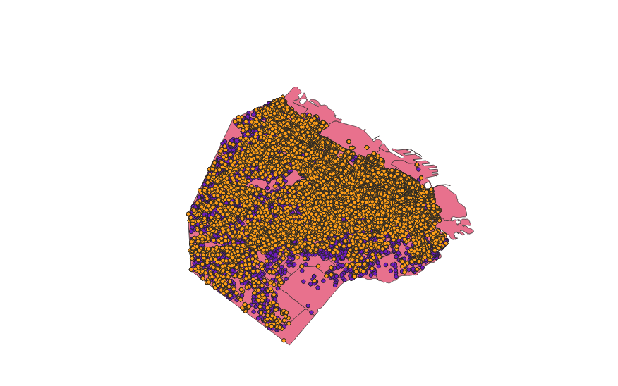

# Buenos Aires Data

Collection of data found for the visualization of Buenos Aires housing. Uses openrefine for cleaning of data and some python for early visualizations.

Everything is in csv format.

prop_data: [Terrenos Valor de Oferta](https://data.buenosaires.gob.ar/dataset/terrenos-valor-de-oferta)

## Example of data

#### Important information:

| **Term** | **Definition** |
| --------- | -------------- |
| Comuna | The city of Buenos Aires is administratively divided into fifteen comunas, unlike the rest of Argentina where the second order administrative division is departamentos, or the Province of Buenos Aires which is subdivided into partidos. Each comuna (commune) of the city encompasses one or more neighbourhoods (barrios), which are represented in the respective community centres for administrative purposes. |
| Barrio | Barrio  is a Spanish word meaning a quarter or neighbourhood. In Spain, several Latin American countries and the Philippines, the term is also used officially to denote a division of a municipality. Baires has 48 barrios, categorized into different Comunas. |

##### Neighborhoods 
| b_id | Barrio Name | Description |
0                 PALERMO
1                BELGRANO
2                   NUÑEZ
3           VILLA ORTUZAR
4               BALVANERA
5           SAN CRISTOBAL
6            VILLA CRESPO
7     VILLA GENERAL MITRE
8                FLORESTA
9        PARQUE CHACABUCO
10      PARQUE AVELLANEDA
11              CABALLITO
12                ALMAGRO
13                POMPEYA
14          VILLA URQUIZA
15               SAAVEDRA
16       VILLA PUEYRREDON
17             VILLA LURO
18              MATADEROS
19                 FLORES
20             VERSAILLES
21                LINIERS
22         VELEZ SARFIELD
23           VILLA DEVOTO
24                   BOCA
25              AGRONOMIA
26              CHACARITA
27               PATERNAL
28             COLEGIALES
29       VILLA DEL PARQUE
30           VILLA LUGANO
31       VILLA SANTA RITA
32               BARRACAS
33           MONTE CASTRO
34        VILLA RIACHUELO
35                 RETIRO
36             MONTSERRAT
37          VILLA SOLDATI
38           CONSTITUCION
39                  BOEDO
40       PARQUE PATRICIOS
41              SAN TELMO
42                COGHLAN
43            SAN NICOLAS
44               RECOLETA
45             VILLA REAL
46          NUEVA POMPEYA
47            PARQUE CHAS
48          PUERTO MADERO